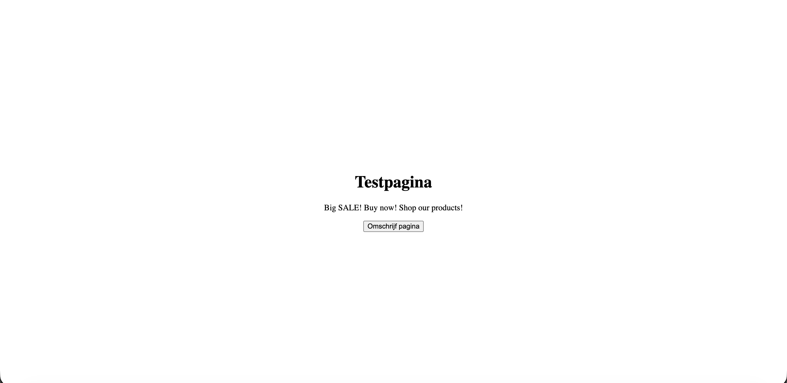
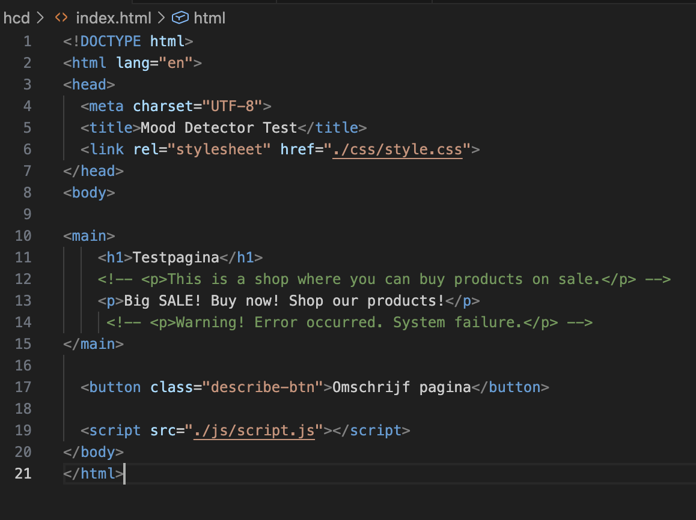
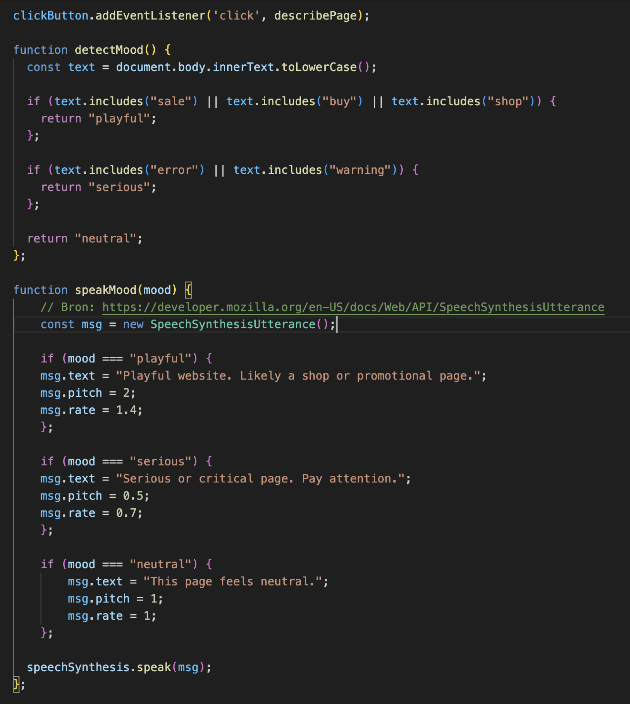
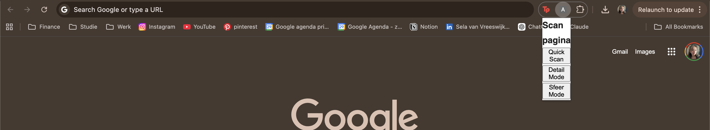
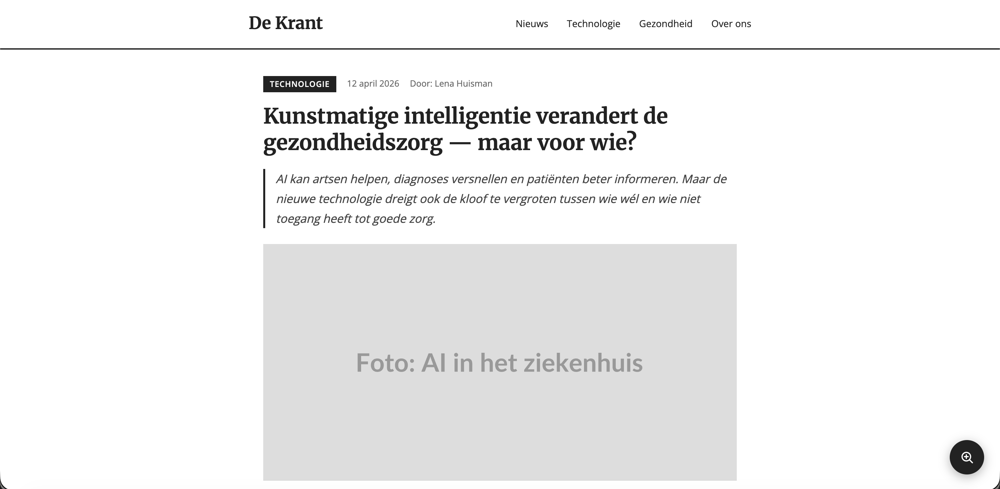
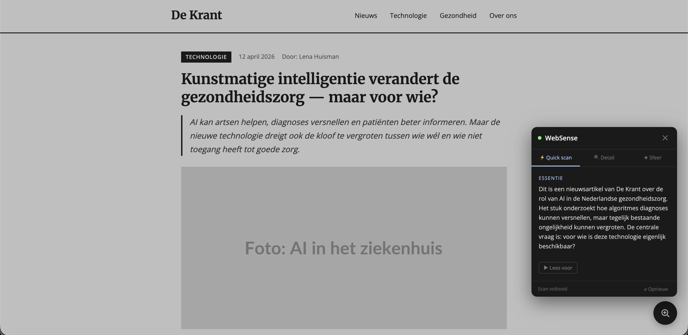
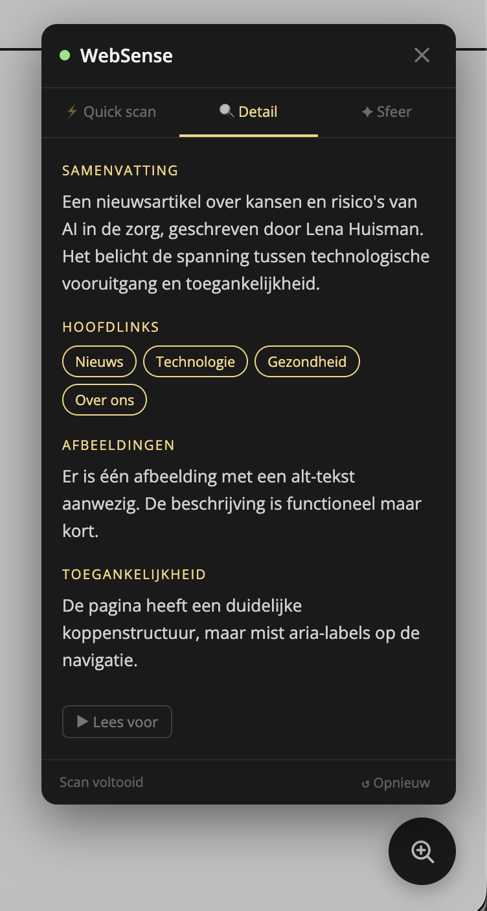
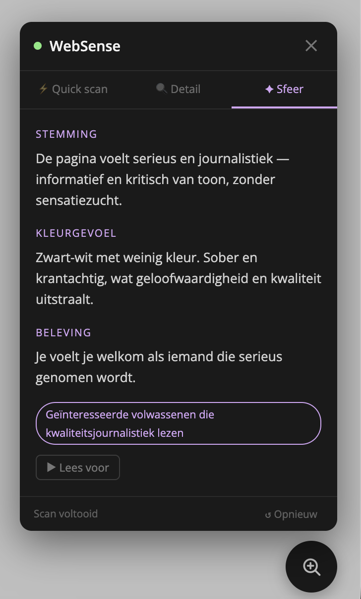
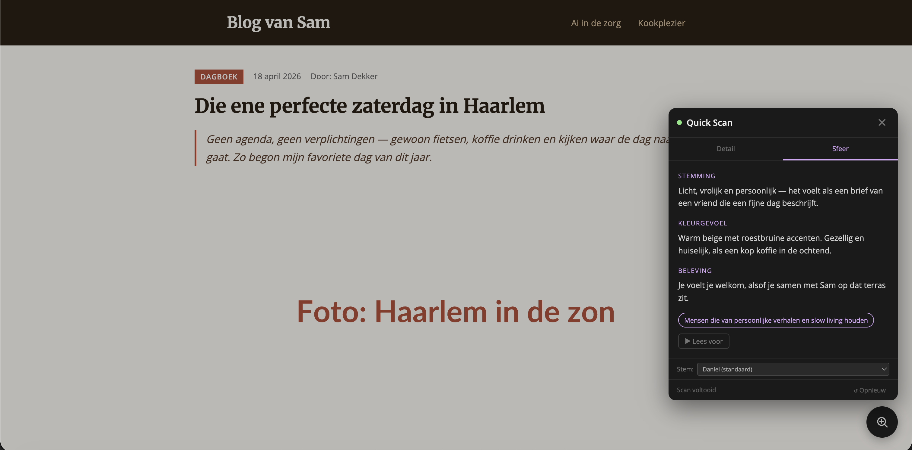
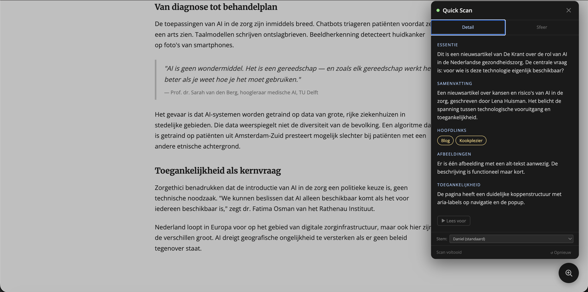

## Weken

Week 8

## Week 8

### Maandag
Vandaag hebben we dit project afgetrapt. Ik ben begonnen met mijn eerste prototype. Mijn idee is om een knop of sneltoets te maken waarmee Ihab erachter kan komen wat de sfeer van de website is. Ik wil dus uitbreiden op het thema 'nuance'. Ik heb vandaag leren werken met SpeechSynthesisUtterance() waarmee je de snelheid en pitch van de standaard screenreader stem kunt aanpassen. 

Mijn prototype ziet er nu als volgt uit: er is een knop waarmee Ihab de sfeer van de website bepaald. Via JavaScript wordt de pagina uitgelezen en wanneer er bepaalde woorden worden gedetecteerd, valt de website in een bepaalde categorie en leest de screenreader dat met een andere stem en pitch aan Ihab voor. Verder heb ik vandaag vragen voor morgen voorbereid. 

### Dinsdag
In de ochtend hebben we een quiz over de Weekly Geek gehad en daarna is Ihab gekomen voor de eerste testronde. Dit zijn de meest relevante notites over mijn concept:
- De stem die ik nu laat gebruiken is niet passend. Hierin kan ik een AI stem gebruiken
- Hij hoeft geen extra sneltoets, heeft liever een button
- Mijn concept kan nuttig zijn bij pagina's die recreationeel zijn, die je zoekt voor plezier. Niet voor functionaliteiten of wanneer hij iets snel wil doen
- Het concept moet iets toevoegen voor hem, niet iets wat er al is zoals de tekst to speech software
- Het omschrijven van de emoties, sfeer, kleuren en omschrijving van de producten zou interessant kunnen zijn. Bijvoorbeeld met AI
- Hetgeen wat hij het meeste mist is op toegankelijkheidsniveau. Dat plaatjes niet omschreven zijn, dat sommige knoppen onduidelijk zijn

Uit deze testronde kwam dus eigenlijk dat Ihab niet veel behoefte heeft aan mijn concept, tenzij het écht iets toevoegd wat hij nog niet heeft en wanneer hij een website wil bezoeken voor plezier. Maar ik kreeg de indruk dat dat niet per se vaak is. Zijn probleem is dat sommige websites gewoon niet te gebruiken zijn, ontoegankelijk zijn, dat de screenreader niet het visuele van een website weergeeft en dat die stem ook saai is. Hier zou ik met AI een oplossing voor kunnen aanbieden, dat die een samenvatting omschrijft van de website met een aangepaste stem. Hij mist kort en bondig samengevat wat de relevante linkjes zijn, tekst, plaatjes "Wat is hier". Wat is de essentie van een website. Wat zijn de belangrijke tekstelementen en links. 

Hierin wil ik verder werken aan het volgende concept: kijken of AI een pagina kan analyseren, vervolgens met een aangepaste stem de pagina omschrijven qua belangrijke linkjes, afbeeldingen, tekst en wat de essentie is van een website. En dan als laatste ook de sfeer van de website, als het voor plezier is. 

### Donderdag 
Feedback:
- Mag het ook faken (dus wat eruit komt met de AI maar ook de plugin)
- Verder gewoon zo doorgaan.

### Vrijdag
Goede vrijdag dus we hadden geen les. 

### Weekverslag week 8
Deze week was een goede startweek maar wel met weinig tijd voor het eerste prototype en de volgende dag gelijk in de startblokken met het testen met Ihab. 

Mijn eerste prototype was als volgt: een knop waarmee een pagina werd omschreven. De pagina-inhoud werd geanalyseerd en vervolgens werd daarop de voice over stem aangepast. 

Week 9

## Week 9

### Maandag
Vandaag was tweede paasdag dus hadden we geen les.

### Dinsdag
Vandaag had ik een begrafenis dus ik was niet bij de les. 

### Vrijdag
Voortgangsgesprek, hier kwam uit: 
- Doorgaan met het faken van de website. Ik hoef geen echte plugin te maken
- Kan het ook aan Ihab doorgeven, kijken of hij interesse heeft in die sfeer pagina
- De optie 'sfeer' kan in de detailpagina toegevoegd worden

### Weekverslag week 9
Deze week was een bewogen week met tweede paasdag, een begrafenis en daarna ziek zijn. Ik heb hierdoor helaas niet veel voortgang kunnen maken en zal dit vak ook moeten herkansen door het gemiste testmoment. Ik wil volgende week nog een inhaalslag gaan maken en ga maandag aan mijn volgende testmoment met Ihab werken. Voor nu ziet mijn prototype er als volgt uit: een chrome-extensie waaruit drie knoppen komen die de pagina analyseren in essentie, detail en sfeer. Het analyseren zelf had ik nog niet werkend gekregen.

Week 10

## Week 10

### Maandag
Vandaag zaten we in de Medialounge. Ik heb mijn derde prototype uitgewerkt: een testpagina gefaked in html en een test pop-up gemaakt. Hier had ik het afgelopen weekend ook al een beetje aan gewerkt. Morgen wil ik dit gaan testen met Ihab en ik wil vooral kijken of dit nuttig voor hem kan zijn en vooral ook op de manier hoe ik het in gedachten had. Zou er ook iets geoptimaliseerd kunnen worden? 

### Dinsdag
Vanochtend heb ik met Ihab mijn tweede test uitgevoerd. Hij was deze keer enthousiaster over mijn prototype. Dit waren de dingen die eruit kwamen en die ik wil gaan aanpassen: 
- De knop om het af te sluiten was niet gelabeld, het kruisje
- De emoji's vóór de knop titels mogen weg 
- 'Quick Scan' en 'Detail' mogen samengevoegd kunnen worden, nu beetje overbodig. Hij wilde sfeer juist wel apart hebben 
- Kijken of ik de stem Frank kan aanpassen
- Testen met verschillende pagina's 

Vanmiddag en volgende week wil ik met de bovenstaande punten aan de slag voor mijn derde prototype. 

### Vrijdag
Deze week hadden we geen voortgangsgesprek vanwege de Smashing Conference. 

### Weekverslag week 10
Deze week heb ik mijn tweede prototype gemaakt, getest en die test ging gelukkig beter dan vorige week. Ik heb een aantal punten als feedback gekregen en daar wil ik aan gaan werken voor volgende week voor mijn volgende prototype. Het voornaamste is dat ik ai eraan wil gaan koppelen om het werkend te laten maken.

Week 11

## Week 11

### Maandag
In de ochtend hebben we een interessant college van Vasilis gehad over exclusive design. Hierna ben ik de hele dag aan de slag gegaan met de feedback van vorige week verwerken: 
- Een aria-label voor het kruisje 
- Twee nieuwe testpagina's aangemaakt voor het contrast per pagina (dit duurde het langst)
- Een keuze aan de stem toegevoegd zodat Ihab kan kiezen met welke stem hij de Quick Scan wilt uitvoeren
- Tot slot heb ik de test voor morgen voorbereid

### Dinsdag
Vandaag hebben we weer een testmoment gehad. Hier kwamen de volgende punten uit: 
- Frank en Alva zijn dezelfde stem bij waar hij een stem kan kiezen, kijken hoe ik dat zou kunnen aanpassen
- Bij de knop voor afspelen staan er nog emoji's = met open cirkel in de knop open sikkel opnieuw
- Popup openen in een dialoog venster, de focus zit er niet in. Dat moet ik oplossen
- Bij blog heet het websense en bij quick scan venster heet de knop anders. Controleren
- Quick scans staan de hoofdlinks nog steeds testpagina 1 & testpagina 3 (in kleur). ws bij pagina 2 & 3

### Vrijdag
Tijdens het voortgangsgesprek vandaag kwam eruit dat ik de bovenstaande punten mag gaan verbeteren en aan de slag mag met een nonsense versie functie voor de website. 

### Weekverslag week 11
In de vakantie wil ik aan de slag gaan met de bovenstaande punten. Ik wil vooral ook gaan kijken naar de exclusive design principles en hoe ik dat kan integreren in mijn prototype. Ik heb hier namelijk nog geen idee voor. 

Week 13

## Week 13

### Woensdag
In de vakantie heb ik minder kunnen doen dan ik had verwacht. Ik ben uiteindelijk veel met het API vak en andere projecten beziggeweest. Vandaag heb ik gewerkt aan de stem, de emoji's, juiste focus en de benaming. Dit duurde allemaal best lang. Ik heb ook alle code doorgelopen, bronnen aangevuld en de puntjes op de ï gezet. 

### Weekverslag week 13
Deze laatste week was afronden. Ik heb bewust geen nieuwe dingen meer toegevoegd maar alles wat er al was netter gemaakt, voor nieuwe dingen toevoegen was er niet veel tijd. De bronnen en het procesverslag kosten meer tijd dan ik dacht, maar het is nuttig om terug te lezen waarom ik bepaalde keuzes heb gemaakt. 

Exclusive Design Principles

## Exclusive Design Principles

De [Exclusive Design Principles](https://exclusive-design.vasilis.nl/) van Vasilis van Gemert zijn ontworpen voor het ontwerpen van toegankelijke ervaringen specifiek voor één persoon, in dit geval Ihab.

### 1. Study situation
Ik heb Ihab meerdere keren getest en geïnterviewd. Hieruit bleek dat hij een screenreader gebruikt en dat hij mist: een snelle samenvatting van wat een pagina inhoudt, een beschrijving van afbeeldingen en links, en inzicht in de sfeer van een recreatieve website. Dit prototype is direct gebouwd op die inzichten.

### 2. Ignore conventions
Normaal gesproken verwacht je dat een gebruiker zelf op een knop drukt om iets voor te laten lezen. In dit prototype leest de Quick Scan automatisch voor zodra de popup opent. De focus gaat via `showModal()` direct naar het dialoogvenster, zodat Ihab geen extra handelingen nodig heeft. Dit gaat in tegen de conventionele verwachting maar werkt beter voor hem.

### 3. Prioritise identity
Ihab kan zelf een stem kiezen die bij hem past. Dubbele stemmen (zoals Frank en Alva die dezelfde onderliggende stem gebruiken) worden gefilterd zodat hij een echte keuze heeft. De inhoud wordt samengevat in het Nederlands, zijn eigen taal.

### 4. Add nonsense
De 'Sfeer'-tab is een speelse toevoeging die niet strikt functioneel is maar voor recreatief gebruik wél interessant kan zijn: wat is de kleur, de stemming, het gevoel van een website? Dit is precies het soort nuance dat een standaard screenreader nooit biedt.

Bronnenlijst

## Bronnen

### HTML
- `<dialog>` element voor toegankelijke modals: https://developer.mozilla.org/en-US/docs/Web/HTML/Element/dialog
- ARIA-rollen en attributen (role="dialog", aria-modal, aria-labelledby): https://developer.mozilla.org/en-US/docs/Web/Accessibility/ARIA/Roles/dialog_role
- `dialog.showModal()` voor focusbeheer: https://developer.mozilla.org/en-US/docs/Web/API/HTMLDialogElement/showModal

### JavaScript
- SpeechSynthesisUtterance — aanpassen van pitch en stem: https://developer.mozilla.org/en-US/docs/Web/API/SpeechSynthesisUtterance
- SpeechSynthesis.getVoices() — beschikbare stemmen ophalen: https://developer.mozilla.org/en-US/docs/Web/API/SpeechSynthesis/getVoices
- Web Speech API overzicht: https://developer.mozilla.org/en-US/docs/Web/API/Web_Speech_API
- localStorage voor het opslaan van gebruikersvoorkeur (stem): https://developer.mozilla.org/en-US/docs/Web/API/Window/localStorage

### CSS
- CSS `::backdrop` pseudo-element voor dialog achtergrond: https://developer.mozilla.org/en-US/docs/Web/CSS/::backdrop
- `min()` functie voor responsieve breedtes: https://developer.mozilla.org/en-US/docs/Web/CSS/min

### Bronnen Exclusive Design
- Exclusive Design Principles van Vasilis van Gemert: https://exclusive-design.vasilis.nl/
- Nothing about us without us — Vasilis van Gemert: https://exclusive-design.vasilis.nl/nothing-about-us-without-us/

### Ongebruikte bestanden
- `popup.js` en `content.js` zijn oorspronkelijke Chrome-extensie bestanden uit het eerste prototype. Ze worden niet meer gebruikt in het huidige webprototype en kunnen worden verwijderd.

